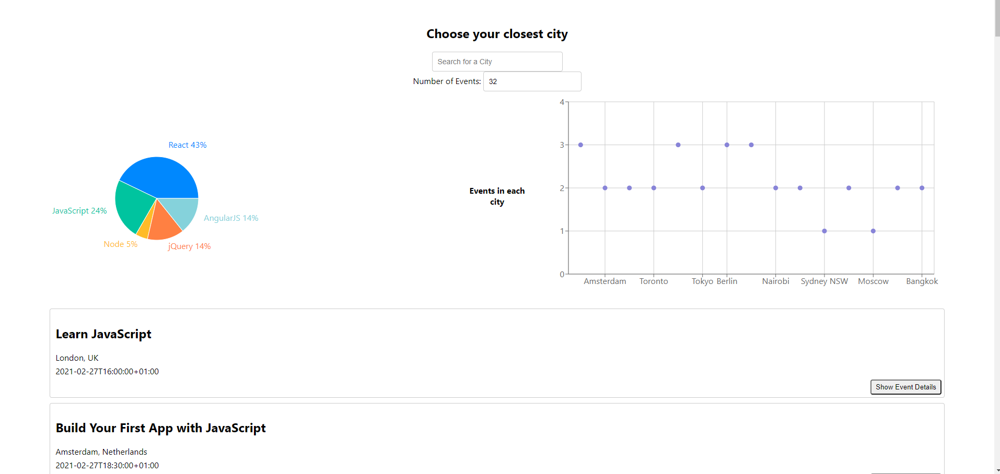
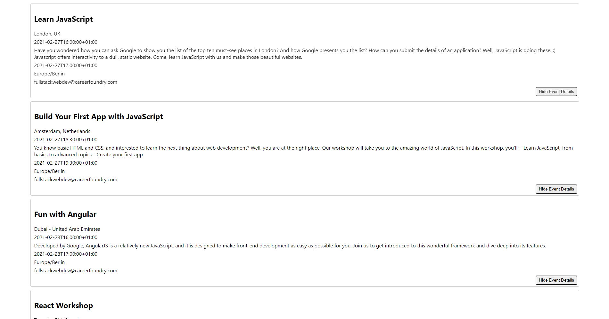

# Meet-Us Application

- Serverless, progressive web application (PWA) built with React using a test-driven development (TDD) technique.
- Uses AWS Lambda to host serverless functions and Google Calendar API to fetch upcoming events.

## Screenshots

## Features
- Filter events by city.
- Specify the number of events to display.
- Show/hide event details.
- Access the app while offline through a Service Worker API.
- Add a shortcut to the app on desktop or mobile home screen.
- View a graph plotting the number of upcoming events in a specific city.
- View a pie chart showing the % of events in a specific city by technology name.

## Deployed Application
- https://glenvasa.github.io/meet
